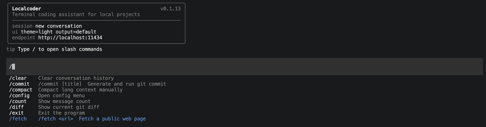

# Localcoder



Chinese version: [README.zh.md](./README.zh.md)

## 📖 Overview

Localcoder is a local-first command-line coding assistant implemented in Rust. It already includes:

- ✅ Streaming chat and one-shot execution for Ollama, OpenAI-compatible APIs, and LM Studio
- ✅ Tool calling runtime with file, search, Bash, web, and LSP tools
- ✅ Interactive REPL with `oxink` input, model switching, session resume, config UI, and output styles
- ✅ Local server mode with HTTP and WebSocket entrypoints
- ✅ Context compaction, git workflows, memory extraction, plan mode, and skills
- ✅ Lightweight runtime with fast startup and low memory usage

> Compared with the JavaScript version, the Rust version starts about **10x faster** and uses about **10x less** memory.

---

## 📊 Implementation Status

The staged roadmap in [`docs/P00-plan.md`](./docs/P00-plan.md) is mostly implemented. Current status: **17 / 22 stages completed**.

| Stage | Area | Status | Deliverable |
|------|------|------|------|
| S00 | Basic chat loop | ✅ | REPL, streaming API, one-shot mode |
| S01 | Tool system architecture | ✅ | `Tool` trait, registry, tool dispatch loop |
| S02 | File tools | ✅ | `Read` / `Edit` / `Write` |
| S03 | Search tools | ✅ | `Glob` / `Grep` |
| S04 | Command execution | ✅ | `Bash` tool with safety checks |
| S05 | Session persistence | ✅ | JSONL session storage, `--continue`, `--resume`, `/resume` |
| S06 | Config system | ✅ | `settings.json`, `/config`, persisted UI preferences |
| S07 | Permission system | ❌ | Rule engine and user confirmation are not implemented yet |
| S08 | Context compaction | ✅ | Automatic compaction, token estimation, `/compact` |
| S09 | Git integration | ✅ | `/diff`, `/review`, `/commit` |
| S10 | Memory system | ✅ | Four memory types and automatic extraction |
| S11 | Sub-agents | ❌ | Forked sub-agents and worktree isolation are not implemented yet |
| S12 | Plan mode | ✅ | `EnterPlanMode`, `ExitPlanMode`, `TodoWrite`, `/plan` |
| S13 | Skill system | ✅ | `SKILL.md`, `skill_tool`, `/skills`, `/<skill-name>` |
| S14 | Web tools | ✅ | `WebSearch`, `WebFetch`, `/web`, `/fetch` |
| S15 | Cost tracking | ❌ | Token accounting and `/cost` are not implemented yet |
| S16 | Multi-provider support | ❌ | Bedrock / Vertex / Foundry are not implemented yet |
| S17 | MCP integration | ❌ | MCP client and transport support are not implemented yet |
| S18 | Output styles | ✅ | Output style loading and `/output-style` |
| S19 | LSP integration | ✅ | Language-server-backed code navigation via `Lsp` |
| S20 | Server mode | ✅ | Axum-based local HTTP and WebSocket server via `/server` |
| S21 | REPL slash menu | ✅ | Slash command suggestions and picker for built-in and skill commands |

---

## 🚀 Quick Start

### 1. Install the Binary

**Option 1: Use the install script**

```bash
curl -fsSL https://raw.githubusercontent.com/iamwjun/localcoder/main/install.sh | bash
```

Supported platforms:
- macOS (arm64 / x86_64)
- Linux (x86_64 / aarch64)

**Option 2: Build from source**

```bash
git clone https://github.com/iamwjun/localcoder.git
cd localcoder
cargo build --release
```

---

### 2. Configure a Provider

On first launch, Localcoder ensures that `$HOME/.localcoder/settings.json` exists.

LLM settings are loaded from that home-level file. Example configurations:

**Ollama**

```json
{
  "llm": {
    "type": "ollama",
    "base_url": "http://localhost:11434",
    "model": "qwen3.5:4b"
  }
}
```

**LM Studio**

```json
{
  "llm": {
    "type": "lmstudio",
    "base_url": "http://localhost:1234",
    "model": "qwen/qwen3-coder-30b"
  }
}
```

**OpenAI-compatible**

```json
{
  "llm": {
    "type": "openai",
    "base_url": "https://api.openai.com/v1",
    "api_key": "sk-...",
    "model": "gpt-4o-mini"
  }
}
```

Optional project-local overrides can live in `.localcoder/settings.json`. Today that path is especially useful for UI and LSP settings:

```json
{
  "ui": {
    "theme": "default",
    "tips": true,
    "output_style": "default"
  },
  "lsp": {
    "enabled": true,
    "servers": [
      {
        "name": "rust-analyzer",
        "command": "rust-analyzer",
        "extensions": [".rs"],
        "language_id": "rust"
      }
    ]
  }
}
```

If you use Ollama, make sure the local service is running and that at least one model has been pulled:

```bash
ollama serve
ollama pull qwen3.5:4b
```

---

### 3. First Run

```bash
# Start the interactive REPL
localcoder
```

On startup the REPL shows a compact banner with session status, UI state, and active endpoint. When tips are enabled it also prints one random startup tip, and the active `llm` / `model` is rendered below the input box.

You can edit `$HOME/.localcoder/settings.json` manually, or switch models from the REPL with `/model`.

---

### 4. Run

```bash
# Interactive REPL mode
localcoder

# One-shot query
localcoder -- "Hello, introduce yourself"

# Continue the latest session for this project
localcoder --continue

# Resume a specific session
localcoder --resume s1712345678-12345

# Start the local server in the foreground
localcoder -- "/server"

# Start the local server on a custom address
localcoder -- "/server 127.0.0.1:4000"
```

Useful interaction details:

- `Ctrl-C`, `Ctrl-D`, `/exit`, and `/quit` all leave the main REPL
- `/resume` opens a session picker and re-renders the loaded conversation history
- `/config` manages theme and startup tip visibility
- `/output-style` switches the active response style without editing JSON by hand

---

## 🌐 Server Mode

Localcoder can also run as a local HTTP and WebSocket server. The default bind address is `127.0.0.1:3000`.

You can start it in either mode:

```bash
# Start in the REPL, but keep the REPL usable
/server
/server status
/server stop

# Start in one-shot mode and keep the process in the foreground
localcoder -- "/server"
localcoder -- "/server 127.0.0.1:4000"
```

Available routes:

- `GET /healthz`
- `POST /v1/message`
- `GET /v1/ws`

Example HTTP request:

```bash
curl -X POST http://127.0.0.1:3000/v1/message \
  -H "content-type: application/json" \
  -d '{
    "message": "Explain the role of src/main.rs",
    "session_id": "",
    "output_style": "default"
  }'
```

Example response:

```json
{
  "session_id": "s1746690000000-12345-0",
  "reply": "src/main.rs bootstraps configuration, registers tools, and decides between REPL and one-shot execution.",
  "model": "qwen3.5:4b"
}
```

WebSocket messages are JSON-based and currently one request maps to one full agent execution:

```json
{
  "type": "message",
  "message": "Continue the previous turn and summarize main.rs",
  "session_id": "s1746690000000-12345-0"
}
```

The server is intentionally local-first:

- It listens on `127.0.0.1` by default
- There is no built-in auth or TLS yet
- `wss` should be handled by a reverse proxy if needed

---

## 🛠️ Built-in Tools

The current toolset includes:

- File tools: `Read`, `Edit`, `Write`
- Search tools: `Glob`, `Grep`
- Shell execution: `Bash`
- Web access: `WebSearch`, `WebFetch`
- Code intelligence: `Lsp`

Example prompts:

```bash
localcoder -- "Read the first 5 lines of src/main.rs"
localcoder -- "Write 'hello world' into /tmp/test.txt"
localcoder -- "search process_chunk function"
localcoder -- "Run rg \"SessionStore\" in the project root"
localcoder -- "Fetch https://www.rust-lang.org/"
```

---

## 📝 REPL Commands

| Command | Description |
|------|------|
| `/resume` | List and resume a previous session |
| `/compact` | Manually compact long conversation context |
| `/diff` | Show the current git diff |
| `/review` | Review the current git diff with the model |
| `/commit [title]` | Generate a commit message and create a git commit |
| `/memory` | List saved memories |
| `/output-style [name]` | List or switch output styles |
| `/web <query>` | Search the public web directly |
| `/fetch <url>` | Fetch a public web page |
| `/server [status\|stop\|host:port]` | Start, stop, or inspect the local HTTP/WebSocket server |
| `/plan` | Show plan-mode status |
| `/plan on` | Enable plan mode manually |
| `/plan off` | Disable plan mode manually |
| `/plan clear` | Clear the persisted todo list |
| `/skills` | List available user-invocable skills |
| `/<skill-name> [args]` | Invoke a user skill directly |
| `/config` | Configure UI settings such as theme and tips |
| `/help` | Show the available commands |
| `/clear` | Clear conversation history |
| `/history` | Show conversation history in JSON format |
| `/model` | Fetch models from the active provider endpoint, switch the active model, and update `$HOME/.localcoder/settings.json` |
| `/count` | Show the message count |
| `/version` | Show the current version |
| `/quit` | Exit the REPL |
| `/exit` | Exit the REPL |

---

## 📦 Project Structure

```text
localcoder/
├── install.sh           # Install script with platform detection
├── Cargo.toml           # Rust project manifest
├── CHANGELOG.md         # Release notes
├── README.md            # English documentation
├── README.zh.md         # Chinese documentation
├── docs/                # Roadmap and stage-by-stage implementation notes
│   ├── P00-plan.md      # Overall staged plan
│   └── S00-S21*.md      # Detailed stage documents
├── examples/            # Example programs
│   ├── basic.rs          # Basic API usage
│   ├── streaming.rs      # Streaming responses
│   ├── conversation.rs   # Multi-turn conversation
│   ├── custom_model.rs   # Custom model parameters
│   └── error_handling.rs # Error handling
└── src/                 # Source code
    ├── main.rs           # Program entry point
    ├── api.rs            # Provider clients and streaming requests
    ├── compact.rs        # Context compaction
    ├── config.rs         # REPL/UI config loading and persistence
    ├── engine.rs         # Agent loop and tool dispatch
    ├── git.rs            # Git workflow helpers
    ├── memory.rs         # Memory extraction and storage
    ├── output_style.rs   # Output style loading and prompt injection
    ├── plan.rs           # Plan mode state and todo management
    ├── repl.rs           # Interactive REPL interface
    ├── runtime.rs        # Shared runtime/bootstrap helpers
    ├── server.rs         # Local HTTP and WebSocket server mode
    ├── session.rs        # JSONL session persistence
    ├── skills.rs         # SKILL.md loading and activation
    ├── tools/            # Built-in tools
    ├── services/lsp/     # Language server integration
    └── types.rs          # Shared types
```

---

## 📋 Tech Stack

| Component | Selection |
|------|----------|
| Async runtime | tokio 1.40 |
| HTTP client | reqwest 0.12 |
| Local server | axum 0.8 |
| JSON handling | serde + serde_json 1.0 |
| Prompt/input UI | oxink 0.1.5 |
| Error handling | anyhow |
| Language tooling | built-in LSP manager + external language servers |

---

## 📈 Performance

| Metric | JavaScript | Rust | Improvement |
|------|------------|------|------|
| Startup time | ~100ms | ~10ms | **10x** |
| Memory usage | ~50MB | ~5MB | **10x** |
| Binary size | N/A | 5-8MB | Standalone deployment |

---

## 📚 What You Can Learn

This project is useful for learning:

1. **Async Rust**: tokio, async/await, and stream handling
2. **HTTP clients**: reqwest and JSON-based APIs
3. **Systems programming**: error handling, ownership, and type safety
4. **CLI development**: terminal UX, prompt rendering, and command-line workflows
5. **Provider integration**: Ollama, OpenAI-compatible APIs, and LM Studio model management

---

## 🤖 Possible Extensions

You can continue extending this project with:

- Permission management and sandboxing
- Sub-agent collaboration
- Token cost tracking
- Multi-provider backends such as Bedrock / Vertex / Foundry
- MCP integration
- GUI frontends with `egui` or `iced`
- WebAssembly support for running in the browser

---

## 📄 License

MIT License
